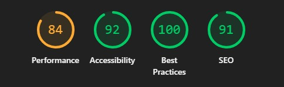

# Happy Gato Baking Website

A responsive, accessible baking website built for **Happy Gato**.  
The project demonstrates modern front-end practices, color-blind friendly design, and SEO/performance optimizations.

---

## 🌟 Features Implemented
- **Responsive Navigation Bar** with mobile toggle button.  
- **Theme Switcher**: supports Default, Protanopia, Deuteranopia, Tritanopia, Achromatopsia, and High-Contrast modes.  
- **Accessible Forms**: semantic labels, required fields, clear focus states.  
- **Contact Page** with HTML5 form fields (`email`, `url`, `date`, `color`, `range`).  
- **About Us Page** with structured biography, mission section, collapsible details, and call-to-action buttons.  
- **Dialog & Modal** examples for user interaction.  
- **Downloadable Media** link for resources (brochure GIF).  
- **Open Graph Meta Tags** for rich previews when shared on social media.  
- **Favicons** for branding.  

---

## ♿ Accessibility Improvements
- **Color-blind Friendly Themes**: multiple themes for different types of color blindness.  
- **High Contrast Theme** for users with low vision.  
- **Semantic HTML**: `<nav>`, `<header>`, `<main>`, `<footer>`, `<form>`, `<dialog>` used appropriately.  
- **ARIA Attributes**: e.g., `role="navigation"`, `aria-label`, `aria-labelledby`.  
- **Keyboard Navigation**: focus management for dialogs and menus.  
- **Visible Labels**: form elements linked with `<label for="">`.  
- **Skip reliance on color only**: uses text/symbols as well.  

---

## 🚀 SEO & Performance Enhancements
- **Meta Tags**: descriptive `<title>` and `<meta>` for pages.  
- **Open Graph Tags**: title, description, image, and type defined for social sharing.  
- **Alt Text** on all images for accessibility + SEO.  
- **File Naming Conventions**: lowercase, no spaces (e.g., `cat-and-coffee.jpg`).  
- **Optimized Images**: using `.jpg/.png` instead of `.jfif` for browser support.  
- **Lazy Loading (optional)**: recommended for future image optimization.  
- **LocalStorage**: persists user’s chosen theme.  
- **Lightweight CSS/JS** with minimal dependencies (Bootstrap only for utility).  

---

## 📊 Lighthouse Report

### After Improvements
- **Performance**: 84
- **Accessibility**: 92  
- **Best Practices**: 100
- **SEO**: 91



---

## 🛠️ Tech Stack
- **HTML5**  
- **CSS3 (with CSS variables for theming)**  
- **JavaScript (ES6)**  
- **Bootstrap 5.3.2**  

---

## 📂 Project Structure
```
.
├── index.html
├── aboutus.html
├── contact.html
├── assets
│   ├── css
│   │   └── styles.css
│   ├── images
│   │   ├── cat-and-coffee.jpg
│   │   ├── catpfp.jpg
│   │   └── icons...
│   ├── media
│   │   └── jumpy.gif

```

---

## 📖 Usage
1. Clone or download this repository.  
2. Open `index.html` in your browser.  
3. Use the **theme selector** in the navigation bar to change themes.  
4. Test forms, dialog, and modal functionality.  

---

## 📌 Notes
- For GitHub Pages, ensure all image/file paths are **relative** (`assets/images/...`) and filenames use **lowercase** with **no spaces**.  
- Replace placeholder Open Graph image URLs with your hosted image path.  
